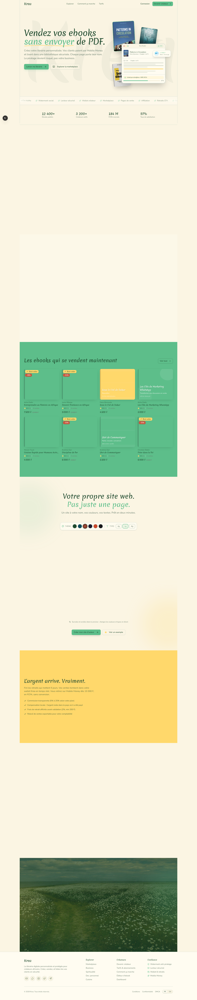
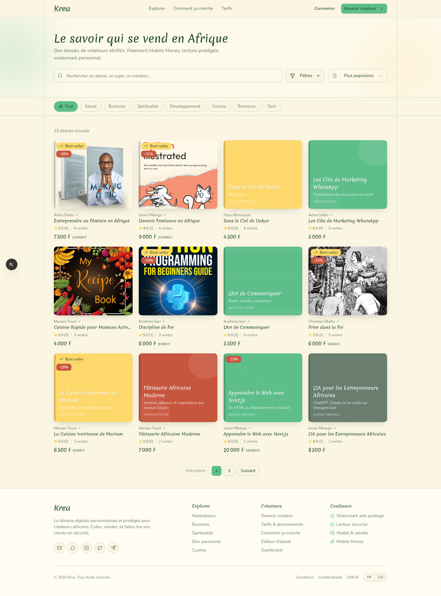
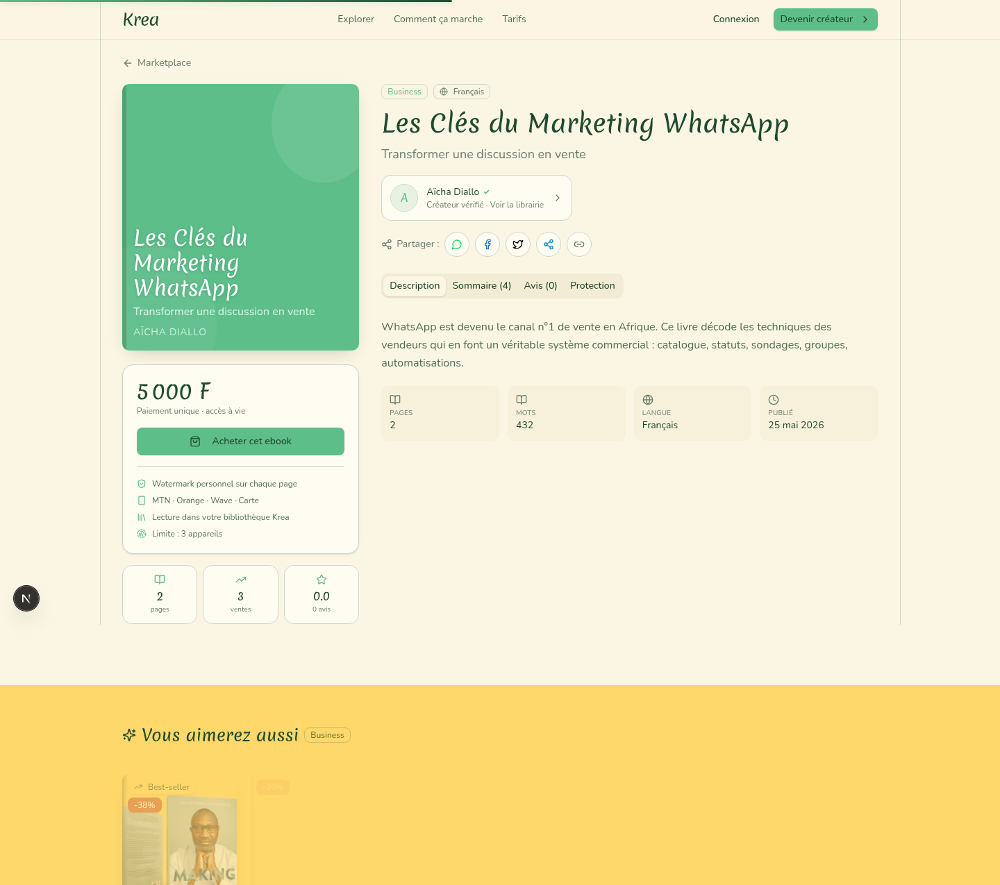
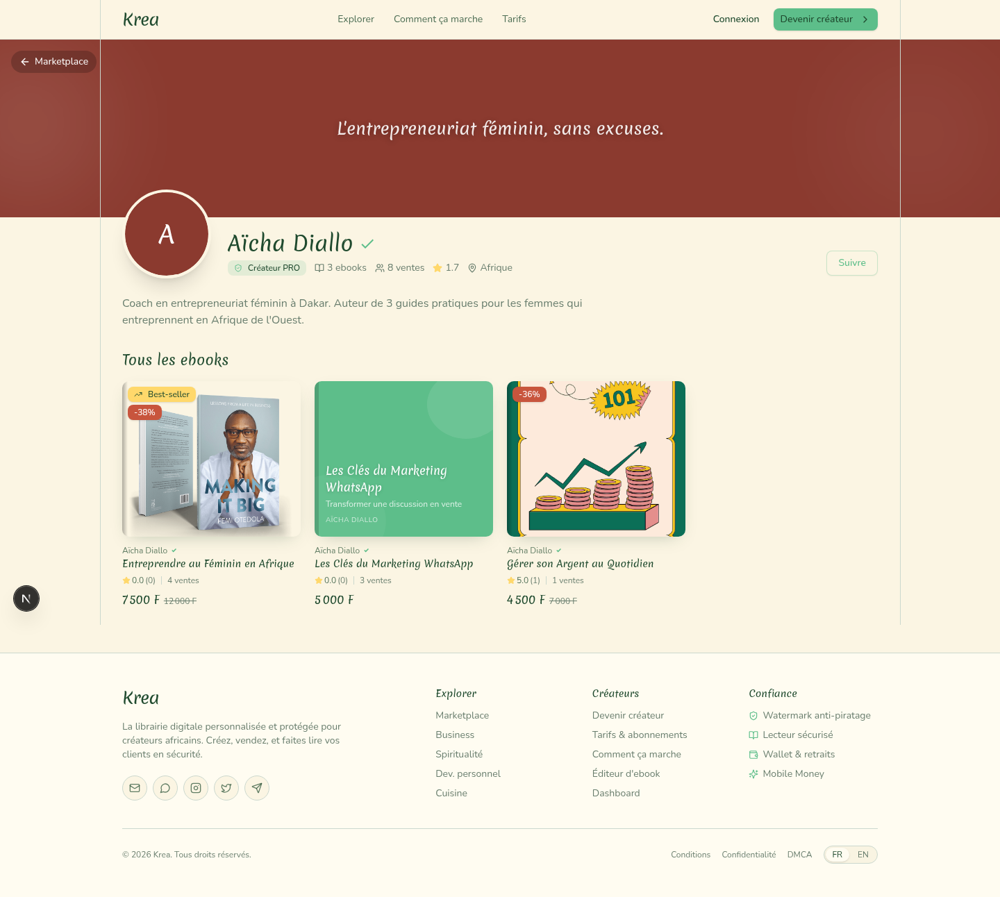
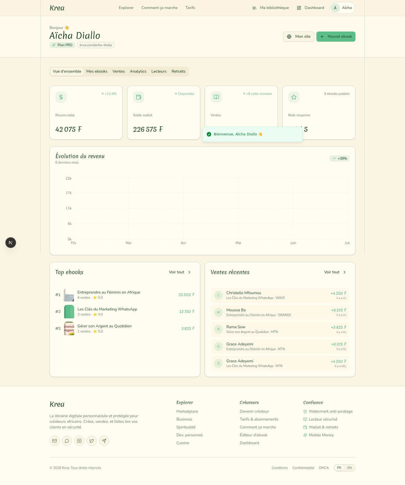
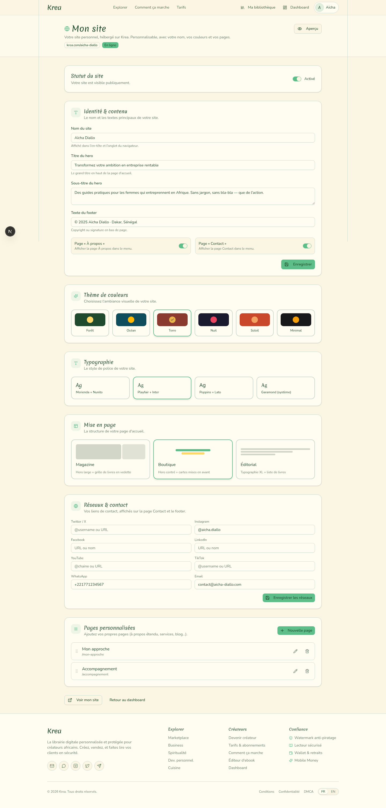

# Krea — Créez, vendez et protégez vos ebooks

> La plateforme tout-en-un pour les créateurs africains qui vendent leur savoir.

Krea permet aux auteurs, coachs et formateurs africains de créer, vendre et protéger leurs ebooks. Pas de PDF téléchargeable nu — tout se lit dans un lecteur sécurisé avec watermark personnel, limite d'appareils et protection anti-piratage.

## Fonctionnalités

### Pour les créateurs
- **Éditeur d'ebooks intégré** — Écrivez chapitre par chapitre en Markdown, générez des couvertures, publiez en un clic
- **Site web personnalisable** — Votre propre site à votre nom (`krea.com/votre-nom`) avec 6 thèmes, 4 typographies, 3 mises en page, pages personnalisées et footer contrôlable
- **Dashboard complet** — Statistiques de ventes, revenus, graphiques, géolocalisation des acheteurs, gestion des retraits
- **Mobile Money** — Encaissez via MTN, Orange, Wave et carte bancaire. Retrait sous 24h en FCFA dès 10 000 F
- **Outils de vente** — Coupons promo, liens d'affiliation, bundles multi-ebooks, pages de vente optimisées
- **Wallet temps réel** — Vos ventes créditées instantanément, retrait quand vous voulez

### Pour les lecteurs
- **Bibliothèque sécurisée** — Tous vos ebooks achetés accessibles en un endroit
- **Lecteur protégé** — Watermark personnel sur chaque page, pas de téléchargement PDF
- **Marque-pages & surlignages** — Reprenez votre lecture où vous l'avez laissée
- **Statistiques de lecture** — Suivez votre progression, objectifs mensuels, temps de lecture

### Protection anti-piratage
- **Watermark social** — Le nom, email et téléphone de l'acheteur sont incrustés sur chaque page
- **Aplatissement** — Les pages sont transformées en images, le watermark ne peut pas être effacé
- **Stéganographie** — Un watermark invisible est caché dans les métadonnées
- **Limite d'appareils** — Accès limité à 3 appareils, le partage de compte est détecté

## Stack technique

| Domaine | Technologie |
|---------|------------|
| Framework | Next.js 16 (App Router, Turbopack) |
| Language | TypeScript 5 |
| Styling | Tailwind CSS 4 + shadcn/ui (New York) |
| Database | Prisma ORM + SQLite |
| Fonts | Merienda (titres) + Nunito (corps) |
| Animations | Framer Motion |
| State | Zustand (client) + SPA view router |
| Icons | Lucide React |

## Pages principales

### Landing page


### Marketplace


### Page détail d'un ebook


### Site créateur personnalisable


### Dashboard créateur


### Éditeur de site


## Démarrage

```bash
# Installer les dépendances
bun install

# Configurer la base de données
bun run db:push
bun run db:seed

# Lancer le serveur de développement
bun run dev
```

L'application est disponible sur `http://localhost:3000`.

## Comptes de test

| Rôle | Email | Mot de passe |
|------|-------|-------------|
| Admin | admin@krea.africa | admin123 |
| Créateur | aicha@krea.africa | creator123 |
| Créateur | junior@krea.africa | creator123 |
| Acheteur | buyer1@krea.africa | buyer123 |

## Design system

- **Background** : `#FBF5E3` (crème)
- **Foreground** : `#1F4A2E` (vert forêt)
- **Primary** : `#5DBE8A` (mint)
- **Accent** : `#FFD86B` (jaune doré)
- **Border** : `#CBD8CE` (gris-vert)
- **Fonts** : Merienda (titres, cursive élégante) + Nunito (corps, sans-serif lisible)

## Licence

Propriétaire — © Krea 2025
